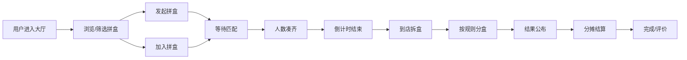

## 1. 产品概述

隐藏款同城闪电拼盒是一款面向潮玩玩家的同城拼盒协作平台，解决潮玩爱好者整盒购买成本高、隐藏款概率低的痛点，通过同城快速拼单、现场拆盒、透明分盒的模式，让玩家以更低成本、更高效率获得心仪的潮玩。

### 核心价值
- **时效优先**：闪电拼单，最快30分钟凑齐开盒
- **同城协作**：商圈附近匹配，到店自提/代取/同城配送
- **透明公正**：多种分盒规则可选，全程公开可追溯
- **社交属性**：聊天协商、结果公布、战绩分享

### 目标用户
- 喜欢现场拆盒体验的潮玩爱好者
- 追求性价比、不想整盒端的普通玩家
- 热衷于隐藏款收集的资深玩家
- 同城潮玩圈社交活跃用户

---

## 2. 核心功能

### 2.1 用户角色

| 角色 | 描述 | 核心权限 |
|------|------|----------|
| 普通用户 | 注册登录的潮玩玩家 | 创建/加入拼盒、聊天、查看历史 |
| 发起人 | 创建拼盒的用户 | 设置分盒规则、管理成员、确认开盒 |
| 参与人 | 加入拼盒的用户 | 选择卡位、协商聊天、确认结算 |

### 2.2 功能模块

1. **拼盒大厅**：首页展示进行中的拼盒，支持城市/商圈/系列筛选
2. **创建拼盒**：选择城市、商圈、到店时间、目标系列、分盒规则
3. **拼盒详情**：剩余卡位、成员预算、凑单进度、倒计时、分盒规则
4. **聊天协商**：拼盒群聊，支持文字/表情/图片
5. **结果公布**：拆盒结果展示，每人获得款式一目了然
6. **分摊结算**：费用明细、支付状态、退款处理
7. **历史战绩**：个人拼盒记录、获得隐藏款统计、胜率数据

### 2.3 页面详情

| 页面名称 | 模块名称 | 功能描述 |
|---------|---------|----------|
| 拼盒大厅 | 顶部导航 | Logo、城市选择、搜索、个人中心入口 |
| 拼盒大厅 | 筛选栏 | 系列筛选、商圈筛选、时间筛选、排序方式 |
| 拼盒大厅 | 拼盒卡片列表 | 展示进行中的拼盒，包含系列、商圈、剩余卡位、倒计时、发起人 |
| 拼盒大厅 | 悬浮按钮 | 快速发起拼盒入口 |
| 创建拼盒 | 城市选择 | 下拉选择城市，支持定位 |
| 创建拼盒 | 商圈选择 | 基于城市展示热门商圈列表 |
| 创建拼盒 | 时间选择 | 选择到店时间，可选立即/预约 |
| 创建拼盒 | 系列选择 | 热门潮玩系列列表，带封面图和价格 |
| 创建拼盒 | 分盒规则 | 隐藏款优先/普通款均分/按序轮转三种模式 |
| 创建拼盒 | 人数设置 | 整盒拆分人数，默认与盒内数量一致 |
| 拼盒详情 | 头部信息 | 系列封面、名称、价格、商圈、到店时间 |
| 拼盒详情 | 凑单进度 | 进度条、已凑人数/总人数、倒计时 |
| 拼盒详情 | 成员列表 | 头像、昵称、卡位、预算、状态 |
| 拼盒详情 | 分盒规则 | 当前规则说明、规则切换（仅发起人） |
| 拼盒详情 | 操作区 | 加入拼盒/退出拼盒/立即补位/确认开盒 |
| 拼盒详情 | 配送方式 | 到店自提/代取/同城送达选项 |
| 聊天协商 | 消息列表 | 气泡式聊天记录，支持时间分组 |
| 聊天协商 | 输入区 | 文字输入、表情、图片、快捷短语 |
| 聊天协商 | 成员列表 | 在线状态、成员角色标识 |
| 结果公布 | 拆盒结果 | 整盒款式展示、每人获得款式高亮 |
| 结果公布 | 隐藏款动画 | 获得隐藏款的庆祝动画效果 |
| 结果公布 | 分享按钮 | 一键分享战绩到社交平台 |
| 分摊结算 | 费用明细 | 整盒价格、人均分摊、运费/服务费 |
| 分摊结算 | 支付状态 | 每人支付进度、待确认/已支付标识 |
| 分摊结算 | 结算操作 | 发起结算、确认收款、申请退款 |
| 历史战绩 | 战绩概览 | 总拼盒数、隐藏款数、胜率统计 |
| 历史战绩 | 记录列表 | 每次拼盒的时间、系列、获得款式、金额 |
| 历史战绩 | 筛选排序 | 按时间/系列/价格筛选排序 |

---

## 3. 核心流程

### 3.1 发起拼盒流程
用户选择城市和商圈 → 选择目标潮玩系列 → 设置到店时间 → 选择分盒规则 → 设置人数和预算 → 发布拼盒 → 等待匹配

### 3.2 加入拼盒流程
浏览拼盒大厅 → 筛选感兴趣的拼盒 → 查看详情和规则 → 选择卡位 → 确认预算 → 加入成功 → 等待凑齐

### 3.3 拆盒分盒流程
人数凑齐 → 倒计时结束 → 到店拆盒 → 上传拆盒视频/照片 → 按规则分盒 → 结果公布 → 费用结算

### 3.4 Mermaid 流程图

---

## 4. 用户界面设计

### 4.1 设计风格

**整体风格**：潮流炫酷、年轻活力、深色霓虹主题

- **主色调**：深紫色 (#6366F1) 作为主色，搭配霓虹粉 (#EC4899) 渐变
- **辅助色**：青绿色 (#10B981) 用于成功状态，琥珀色 (#F59E0B) 用于警告/倒计时
- **背景色**：深灰蓝渐变 (#0F172A → #1E293B)，营造科技感和潮流感
- **卡片风格**：毛玻璃效果 (backdrop-filter) + 霓虹边框发光
- **按钮风格**：圆角大按钮，渐变填充，hover时有发光效果
- **字体**：标题使用具有设计感的无衬线字体，正文清晰易读
- **图标风格**：线性图标，统一24px尺寸，支持彩色填充

### 4.2 视觉特色
- 霓虹灯文字效果用于重点信息
- 粒子动画背景增加动感
- 卡片悬浮时的光影变化
- 隐藏款揭晓时的金色光芒动画
- 倒计时的脉冲动画效果

### 4.3 页面设计概览

| 页面名称 | 模块名称 | UI Elements |
|---------|---------|-------------|
| 拼盒大厅 | Hero区域 | 大标题+副标题、动态背景、搜索框 |
| 拼盒大厅 | 拼盒卡片 | 渐变边框、毛玻璃背景、霓虹进度条、倒计时动画 |
| 创建拼盒 | 步骤指示器 | 彩色步骤圆点、连接线、完成状态动画 |
| 创建拼盒 | 选择卡片 | 图片卡片网格、选中态发光边框 |
| 拼盒详情 | 头部 | 大图封面、渐变遮罩、信息叠加 |
| 拼盒详情 | 成员卡位 | 头像环形排列、位置编号、状态标签 |
| 拼盒详情 | 进度条 | 霓虹发光进度条、数字跳动动画 |
| 聊天协商 | 消息气泡 | 差异化气泡样式、时间戳、已读标识 |
| 结果公布 | 结果展示 | 卡片翻转效果、隐藏款金光特效 |
| 历史战绩 | 数据卡片 | 数字滚动动画、图表可视化 |

### 4.4 响应式设计

- **桌面优先**：以1440px宽度为设计基准
- **平板适配**：768px - 1024px，卡片从3列变2列
- **手机适配**：375px - 767px，单列布局，底部导航
- **触摸优化**：按钮最小44px触控区域，合理间距

---

## 5. 核心业务规则

### 5.1 分盒规则

**隐藏款优先模式**：
- 隐藏款出价最高者获得
- 普通款按顺序轮流选择
- 出价高者有优先选择权

**普通款均分模式**：
- 隐藏款随机抽取
- 普通款平均分配
- 差额多退少补

**按序轮转模式**：
- 按加入顺序轮流选择
- 第一轮正向，第二轮反向（蛇形选秀）
- 隐藏款在轮次中出现时按当前顺序决定

### 5.2 拼盒状态

- **招募中**：发布后等待人齐
- **凑齐待开**：人已齐，等待到店时间
- **拆盒中**：正在现场拆盒
- **已完成**：分盒结算完成
- **已取消**：超时未凑齐或主动取消

### 5.3 超时规则

- 招募超时：发布后2小时未凑齐自动取消
- 支付超时：加入后15分钟未支付定金自动退出
- 确认超时：结果公布后24小时未确认自动完成
