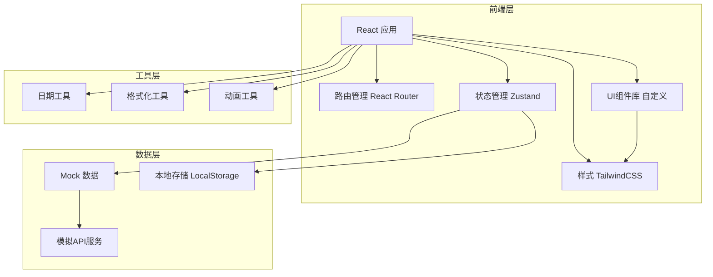
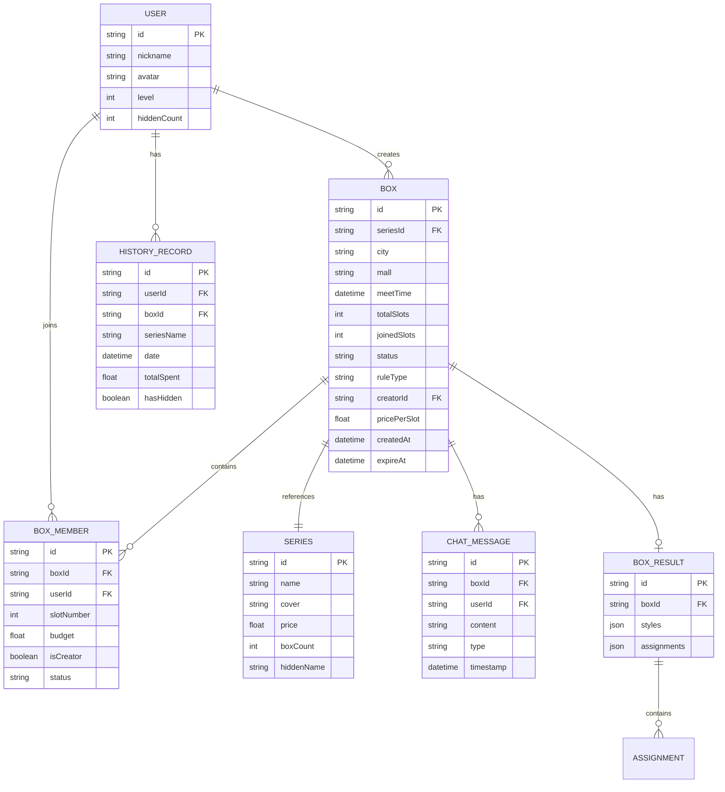

## 1. 架构设计



## 2. 技术选型

| 层级 | 技术 | 版本 | 说明 |
|------|------|------|------|
| 构建工具 | Vite | latest | 快速构建开发 |
| 框架 | React | 18.x | 前端框架 |
| 语言 | TypeScript | latest | 类型安全 |
| 路由 | react-router-dom | 6.x | 路由管理 |
| 状态管理 | zustand | latest | 轻量级状态管理 |
| 样式 | TailwindCSS | 3.x | 原子化CSS |
| 图标 | lucide-react | latest | 图标库 |
| 后端 | 无 | - | 纯前端Mock演示 |

### 初始化方式
使用 `react-ts` 模板初始化，包含：
- React + TypeScript
- React Router DOM
- TailwindCSS
- Zustand

## 3. 路由定义

| 路由路径 | 页面组件 | 说明 |
|---------|---------|------|
| `/` | HallPage | 拼盒大厅首页 |
| `/create` | CreatePage | 创建拼盒 |
| `/box/:id` | BoxDetailPage | 拼盒详情 |
| `/box/:id/chat` | ChatPage | 聊天协商 |
| `/box/:id/result` | ResultPage | 结果公布 |
| `/box/:id/payment` | PaymentPage | 分摊结算 |
| `/history` | HistoryPage | 历史战绩 |

## 4. 目录结构

```
src/
├── components/          # 通用组件
│   ├── Layout/         # 布局组件
│   │   ├── Header.tsx
│   │   ├── Footer.tsx
│   │   └── Container.tsx
│   ├── BoxCard/        # 拼盒卡片
│   │   └── BoxCard.tsx
│   ├── MemberAvatar/   # 成员头像
│   │   └── MemberAvatar.tsx
│   ├── ProgressBar/    # 进度条
│   │   └── ProgressBar.tsx
│   ├── CountDown/      # 倒计时
│   │   └── CountDown.tsx
│   └── ui/             # 基础UI组件
│       ├── Button.tsx
│       ├── Card.tsx
│       ├── Modal.tsx
│       ├── Tag.tsx
│       └── Input.tsx
├── pages/              # 页面组件
│   ├── HallPage.tsx   # 拼盒大厅
│   ├── CreatePage.tsx # 创建拼盒
│   ├── BoxDetailPage.tsx # 拼盒详情
│   ├── ChatPage.tsx   # 聊天协商
│   ├── ResultPage.tsx # 结果公布
│   ├── PaymentPage.tsx # 分摊结算
│   └── HistoryPage.tsx # 历史战绩
├── store/              # 状态管理
│   └── useBoxStore.ts # 拼盒状态
├── data/               # Mock数据
│   ├── boxes.ts       # 拼盒数据
│   ├── series.ts      # 系列数据
│   └── users.ts       # 用户数据
├── types/              # 类型定义
│   └── index.ts       # 类型导出
├── utils/              # 工具函数
│   ├── format.ts      # 格式化工具
│   └── date.ts        # 日期工具
├── App.tsx             # 应用入口
├── main.tsx            # 渲染入口
└── index.css           # 全局样式
```

## 5. 数据模型

### 5.1 核心类型定义

```typescript
// 用户类型
interface User {
  id: string;
  nickname: string;
  avatar: string;
  level: number;
  hiddenCount: number; // 获得隐藏款数量
}

// 潮玩系列
interface Series {
  id: string;
  name: string;
  cover: string;
  price: number; // 整盒价格
  boxCount: number; // 一盒数量
  hiddenName: string; // 隐藏款名称
  hiddenImage: string;
  styles: SeriesStyle[];
}

interface SeriesStyle {
  id: string;
  name: string;
  image: string;
  isHidden: boolean;
  rarity: 'common' | 'rare' | 'hidden';
}

// 拼盒信息
interface Box {
  id: string;
  seriesId: string;
  seriesName: string;
  seriesCover: string;
  city: string;
  district: string;
  mall: string; // 商圈
  storeName: string; // 门店
  meetTime: Date; // 到店时间
  totalSlots: number; // 总卡位
  joinedSlots: number; // 已占卡位
  status: BoxStatus;
  ruleType: RuleType;
  creatorId: string;
  creatorName: string;
  creatorAvatar: string;
  pricePerSlot: number; // 人均价格
  createdAt: Date;
  expireAt: Date;
  members: BoxMember[];
}

type BoxStatus = 'recruiting' | 'full' | 'opening' | 'completed' | 'cancelled';
type RuleType = 'hidden-first' | 'average' | 'rotation';

interface BoxMember {
  userId: string;
  nickname: string;
  avatar: string;
  slotNumber: number; // 卡位编号
  budget: number; // 预算
  isCreator: boolean;
  status: 'pending' | 'paid' | 'confirmed';
  joinedAt: Date;
}

// 拆盒结果
interface BoxResult {
  boxId: string;
  styles: ResultStyle[];
  assignments: Assignment[];
}

interface ResultStyle {
  styleId: string;
  styleName: string;
  styleImage: string;
  isHidden: boolean;
  slotNumber: number;
}

interface Assignment {
  userId: string;
  nickname: string;
  avatar: string;
  slotNumber: number;
  styles: ResultStyle[];
}

// 聊天消息
interface ChatMessage {
  id: string;
  boxId: string;
  userId: string;
  userName: string;
  userAvatar: string;
  content: string;
  type: 'text' | 'image' | 'system';
  timestamp: Date;
}

// 历史记录
interface HistoryRecord {
  id: string;
  boxId: string;
  seriesName: string;
  seriesCover: string;
  date: Date;
  mall: string;
  gotStyles: GotStyle[];
  totalSpent: number;
  hasHidden: boolean;
}

interface GotStyle {
  name: string;
  image: string;
  isHidden: boolean;
}
```

### 5.2 ER 图



## 6. 状态管理设计

使用 Zustand 管理全局状态，主要包含：

- 当前用户信息
- 拼盒列表数据
- 当前选中的拼盒详情
- 聊天消息列表
- 历史战绩数据

## 7. 动画与交互设计

### 7.1 CSS 动画
- 渐变背景流动动画
- 霓虹发光 pulse 动画
- 卡片悬浮上浮效果
- 倒计时数字跳动

### 7.2 页面过渡
- 淡入淡出切换
- 左右滑动过渡
- 元素渐次出现 (staggered reveal)

### 7.3 交互动效
- 按钮点击缩放
- 隐藏款揭晓金光效果
- 进度条平滑过渡
- 消息气泡弹出动画
